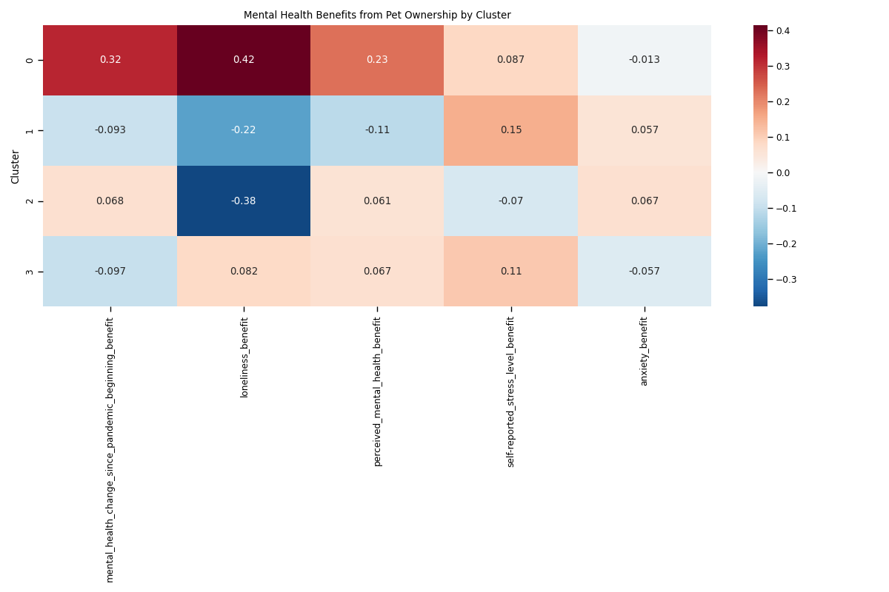
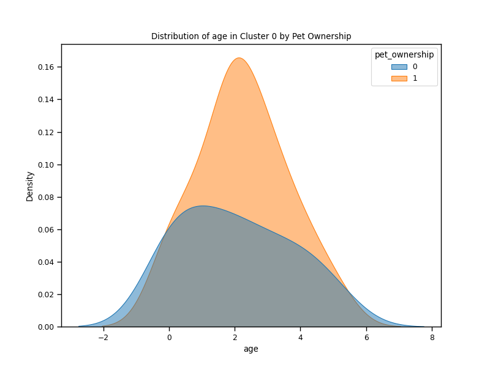
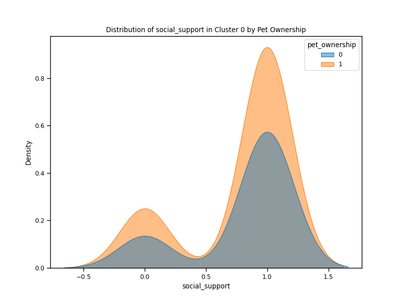

# Pet Benefits During COVID-19 Pandemic

## Overview
This repository contains data analysis exploring which demographic groups benefited most from pet ownership during the social isolation of the COVID-19 pandemic. The analysis uses a dataset from the Harvard Dataverse titled "Association between Pet Ownership and Mental Health and Well-Being of Canadians Assessed in a Cross-Sectional Study during the COVID-19 Pandemic."

## Data Source
- Dataset: [Harvard Dataverse](https://dataverse.harvard.edu/file.xhtml?fileId=5244752&version=5.1)
- Citation: Denis-Robichaud, Jose; Aenishaenslin, Cecile; Richard, Lucie; Desmarchelier, Marion; Carabin, Helene, 2021, "Association between Pet Ownership and Mental Health and Well-Being of Canadians Assessed in a Cross-Sectional Study during the COVID-19 Pandemic", https://doi.org/10.7910/DVN/JKDKWY, Harvard Dataverse, V5

## Files
- `dataset_petandcovid.csv` - Original dataset
- `train.csv` - Training dataset (75% of data)
- `test.csv` - Testing dataset (25% of data)
- `petsandcovid.ipynb` - Main Jupyter notebook containing all analysis code

## Methodology
1. **Data Preprocessing**
   - Data cleaning and transformation
   - Scaling of mental health indicators
   - Train-test splitting

2. **Exploratory Data Analysis**
   - Analysis of mental health indicators
   - Geographic analysis by province/territory and region
   - Demographic variable correlation with mental health outcomes

3. **Machine Learning Approaches**
   - **XGBoost** - Feature importance analysis to identify demographic factors correlated with mental health benefits
   - **K-means Clustering** - Identification of demographic clusters and analysis of pet ownership benefits within each cluster

4. **Mental Health Indicators**
   - `mental_health_change_since_pandemic_beginning` (-2 to 2 scale)
   - `loneliness` (higher score = more lonely)
   - `perceived_mental_health` (-2 to 2 scale)
   - `self-reported_stress_level` (higher score = more stress)
   - `anxiety` (higher score = more anxiety)

## Key Findings
Based on the cluster analysis, Cluster 0 showed the greatest mental health benefit from pet ownership during the COVID-19 pandemic. The demographic profile and specific mental health benefits for this cluster are visualized in the images below.

## Visualizations

### Clusters Analysis

#### Cluster PCA Plot

#### Demographics by Cluster

#### Mental Health by Cluster and Pet Ownership

#### Pet Benefit Heatmap

### Cluster 0 Results (Cluster showing greatest benefit from pet ownership)

#### Age Distribution in Cluster 0

#### Household Size Distribution in Cluster 0

#### Quality of Life Distribution in Cluster 0

#### Social Support Distribution in Cluster 0

## Requirements
- Python 3.7-3.9 (Python 3.8 recommended)
- Libraries: 
  - pandas
  - numpy
  - scikit-learn
  - xgboost
  - matplotlib
  - seaborn

## License
This research utilizes data from Harvard Dataverse which is subject to their usage policies.